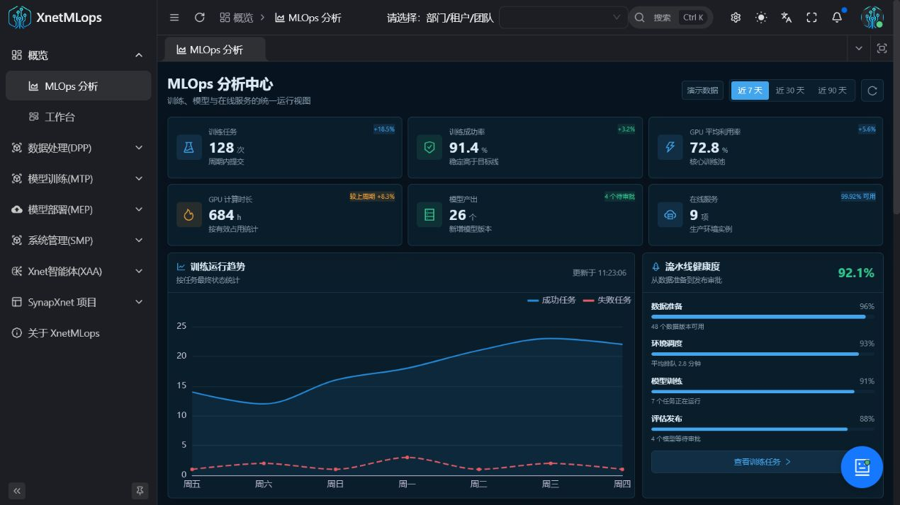
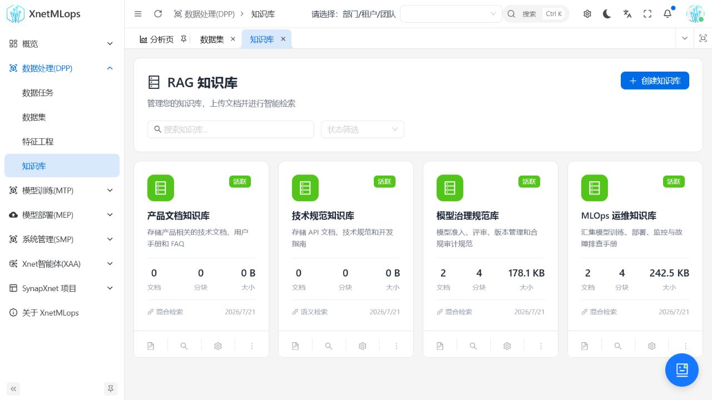
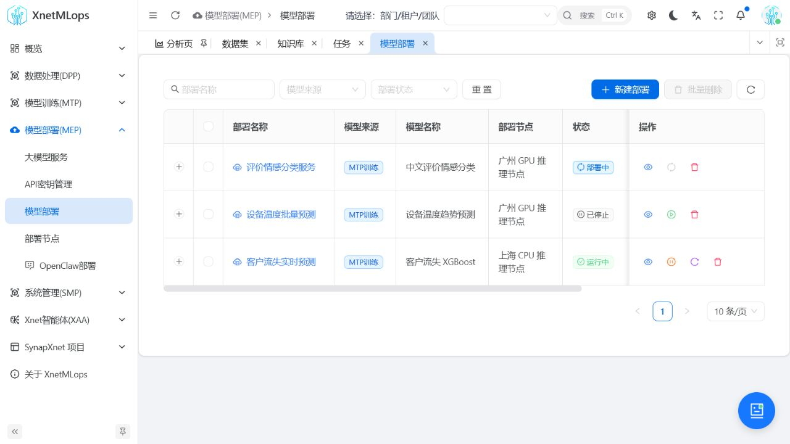
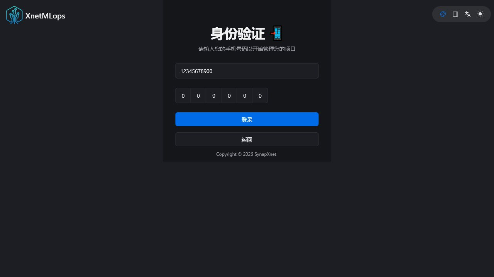
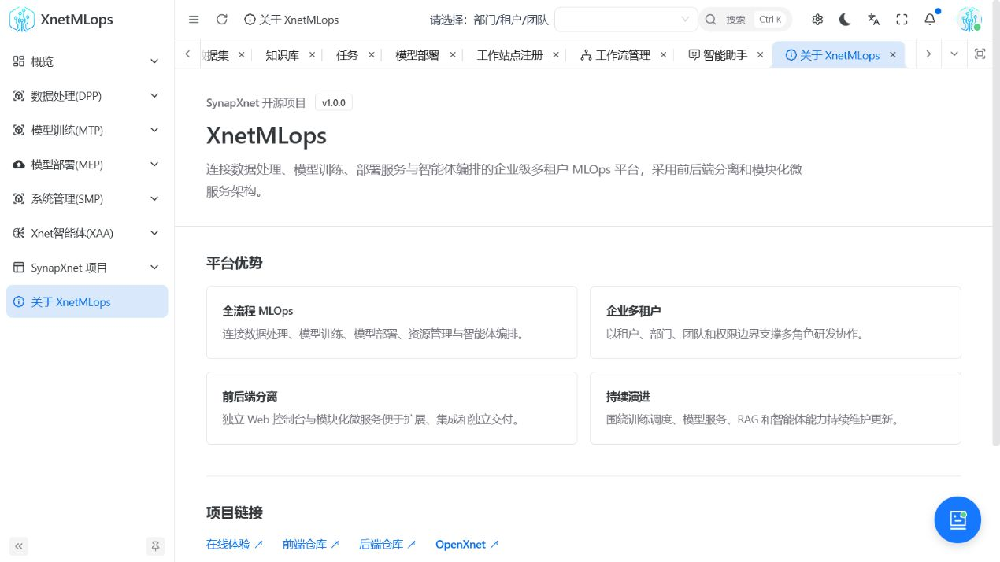
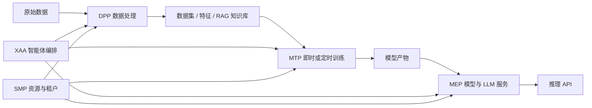

<!-- GOAI-RELEASE-LINKS -->
> GOAI competition release: [`goai-v1.1.0`](./GOAI-RELEASE.md) · [Security](./SECURITY.md) · [Notice](./NOTICE) · [CycloneDX SBOM](./sbom.cdx.json)

<div align="center">

**简体中文** | [English](./README.en-US.md) | [日本語](./README.ja-JP.md)

# XnetMLops

**连接数据处理、模型训练、部署服务与智能体编排的开源 MLOps 平台**

[](https://www.xnetmlops.synapxnet.cn)
[](https://www.oracle.com/java/)
[](https://spring.io/projects/spring-boot)
[](./LICENSE)

[在线体验](https://www.xnetmlops.synapxnet.cn) · [前端仓库 XnetMLops-web](https://github.com/synapxnet/XnetMLops-web) · [OpenXnet 开源社区](https://openxnet.synapxnet.com) · [查看许可](./LICENSE)

</div>



## 界面预览

以下界面由配套前端仓库 [XnetMLops-web](https://github.com/synapxnet/XnetMLops-web) 提供，展示数据来自 `demo/showcase_data.sql`。

### DPP 数据处理

| 数据集管理 | RAG 知识库 |
| --- | --- |
|  |  |

### MTP 模型训练与 MEP 模型部署

| 训练任务 | 模型部署 |
| --- | --- |
|  |  |

### SMP 系统管理与 XAA 智能体

| 工作站资源 | 智能体工作流 |
| --- | --- |
|  |  |

| 元技能仓库 | 智能助手 |
| --- | --- |
|  |  |

### 演示入口与项目信息

| 演示登录 | 关于项目 |
| --- | --- |
|  |  |

## 界面预览

以下界面由配套前端仓库 [XnetMLops-web](https://github.com/synapxnet/XnetMLops-web) 提供，展示数据来自 `demo/showcase_data.sql`。

### DPP 数据处理

| 数据集管理 | RAG 知识库 |
| --- | --- |
|  |  |

### MTP 模型训练与 MEP 模型部署

| 训练任务 | 模型部署 |
| --- | --- |
|  |  |

### SMP 系统管理与 XAA 智能体

| 工作站资源 | 智能体工作流 |
| --- | --- |
|  |  |

| 元技能仓库 | 智能助手 |
| --- | --- |
|  |  |

### 演示入口与项目信息

| 演示登录 | 关于项目 |
| --- | --- |
|  |  |

## 项目简介

XnetMLops 是由 **SynapXnet 团队**开源的全流程 MLOps 平台，面向机器学习、生成式 AI 与智能体应用，将数据准备、模型训练、模型部署、资源管理和智能体编排连接为可持续迭代的工程闭环。

本仓库是平台后端，与 [XnetMLops-web](https://github.com/synapxnet/XnetMLops-web) 前端仓库共同组成企业级、多租户、前后端分离系统。平台以独立微服务承载 DPP、MTP、MEP、SMP 与 XAA 五个核心业务域，可以对接 Hadoop、Jenkins、对象存储、镜像仓库与模型推理节点。

## GOAI Competition 1.0.0

`GOAI-Competition` 分支新增部署证据、真实 Fixture 推理探针和受审批保护的持久化回滚动作。写操作具备职责分离、幂等、乐观锁、进程恢复与独立验证；`dryRun=true` 只返回执行计划，不创建 Action、审计回执，也不修改数据库或 Runtime。

[查看迁移、审批联调、调用样例和验证记录](./docs/goai-handoff/HANDOFF-GOAI-COMPETITION-1.0.0.md) · [配套模型证据页](https://github.com/synapxnet/XnetMLops-web/tree/GOAI-Competition)

## 项目优势

- **企业多租户**：通过租户、部门、团队、角色和资源边界支撑多角色协作。
- **前后端分离**：Web 控制台与后端服务独立交付，便于企业集成和二次开发。
- **全流程闭环**：连接数据处理、定时训练、模型部署、推理服务与智能体编排。
- **开放式集成**：可对接 Hadoop、Jenkins、对象存储、Harbor 与模型计算节点。
- **持续更新**：SynapXnet 团队会持续完善训练调度、模型服务、RAG、智能体与文档。

## 核心能力

| 模块 | 服务目录 | 说明 |
| --- | --- | --- |
| DPP 数据处理 | `mlops-dpp-service` | 管理数据集、预处理与特征工程，编排定时数据管道；支持 RAG 知识库与 Jenkins 执行集成 |
| MTP 模型训练 | `mlops-mtp-service` | 管理算法与训练任务，配置数据集、变量和运行参数；支持立即或定时训练，并跟踪训练状态、日志与模型产物 |
| MEP 模型部署 | `mlops-mep-service` | 管理模型部署、LLM 服务、API 密钥、部署节点和运行日志，并支持 OpenClaw 实例管理 |
| SMP 系统管理 | `mlops-smp-service` | 管理租户、部门、团队、数据源、存储桶、工作站以及 Hadoop、Jenkins、Harbor、镜像和算子资源 |
| XAA 智能体 | `mlops-xaa-service` | 创建智能体助手，管理会话与消息，通过可视化工作流、技能和编排能力调用 DPP、MTP 与 MEP |
| Login 认证服务 | `mlops-login` | 提供登录认证和平台访问入口，为多模块协作提供统一身份基础 |

## 典型工作流



后端基于 Java 17、Spring Boot 3.4.6 与 Maven 多模块工程构建，使用 MySQL 和 Redis 保存平台数据，并通过 Hadoop、Jenkins、Harbor 等外部系统执行数据处理、训练和制品交付任务。

## 目录结构

```text
XnetMLops/
├── mlops-dpp-service/    # 数据处理与 RAG 知识库
├── mlops-mtp-service/    # 模型训练
├── mlops-mep-service/    # 模型部署与推理服务
├── mlops-smp-service/    # 租户和基础资源管理
├── mlops-xaa-service/    # 智能体与工作流编排
├── mlops-login/          # 登录认证
├── docs/                 # 专题文档与项目图片
├── nginx/                # 反向代理配置
├── XnetMLops.sql         # 数据库初始化脚本
└── docker-compose.yml    # 容器编排
```

## 快速开始

### 环境要求

- JDK 17+
- Maven 3.9+
- Docker 与 Docker Compose
- MySQL 8.x、Redis 7.x
- 按启用模块准备 Hadoop、Jenkins、Harbor 或对象存储

### Maven 构建

```bash
mvn -DskipTests package
```

### 容器启动

复制环境变量模板，配置数据库、Redis、HDFS、Jenkins、`JENKINS_API_TOKEN` 与 `JWT_SECRET`；如需同时启动 Web，请先构建同级的 `XnetMLops-web` 仓库，并确认 `WEB_DIST_PATH` 指向前端产物。

```bash
cp .env.example .env
docker compose up -d --build
docker compose ps
```

生产环境请使用专用服务账号、独立密钥和最小权限策略，不要沿用演示环境配置。

## 在线体验

- 访问地址：<https://www.xnetmlops.synapxnet.cn>
- 演示手机号：`17870171303`
- 演示验证码：`000000`

固定验证码仅用于开源项目展示，不应作为生产环境认证方案。

## SynapXnet 开源生态

XnetMLops 是 SynapXnet 开源体系的 AI 工程平台。更多团队项目、技术方向与社区动态请访问 [OpenXnet](https://openxnet.synapxnet.com)。

## 参与贡献

欢迎通过 Issue 提交缺陷与需求，或通过 Pull Request 贡献新算子、训练适配、部署后端和智能体能力。涉及数据结构或外部服务契约的变更，请同时提供迁移说明。

## 开源许可

本项目基于 [MIT License](./LICENSE) 开源。你可以自由使用、修改和分发本项目，但须保留原始版权与许可声明。
